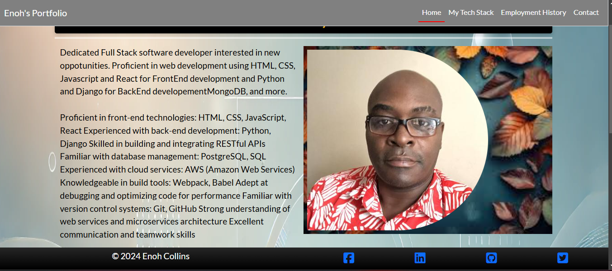
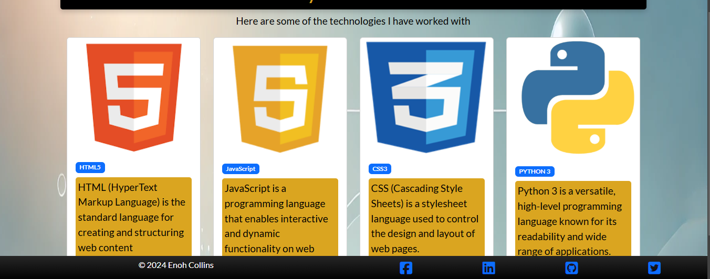
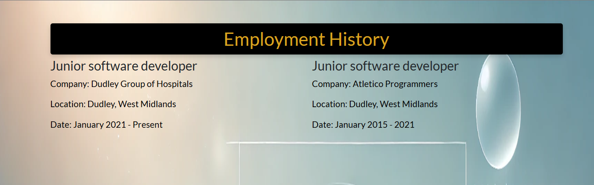
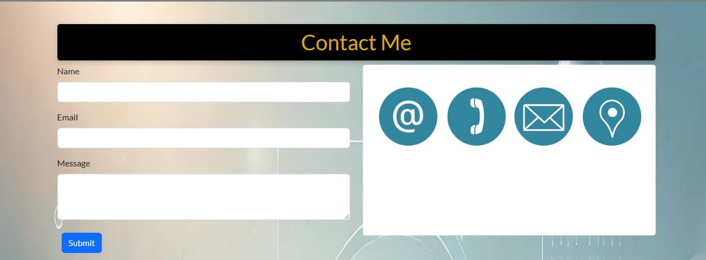
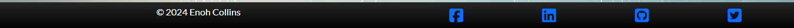
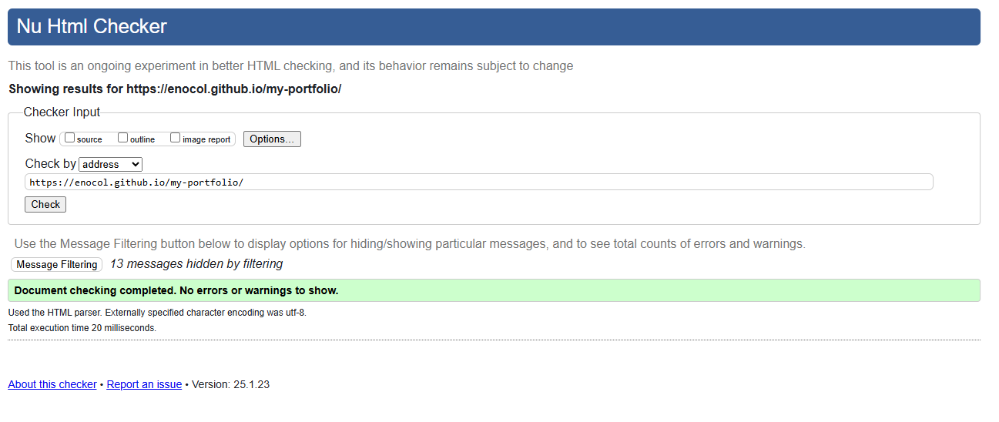
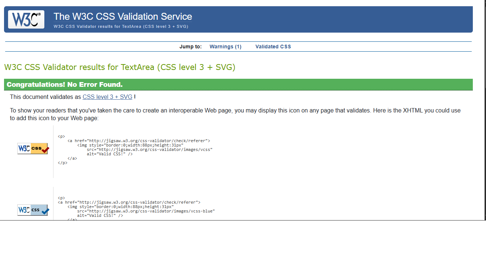

<h1 align='center'> Task Manager </h1>

View live project here:
https://enocol.github.io/my-portfolio/

Welcome to my portfolio website. The website aims to showcase a software developer's skills and interest to potential recruiters.

## Index

- [User Experience](#user-experience-ux)
- [Features](#features)
- [Design](#design)
- [Technologies Used](#technologies-used)
- [Testing](#testing)
- [Deployment](#deployment)
- [Future Features](#future-features)
- [Credits](#credits)

## User Experience / User Stories (UX)

As a user, I want to:

- Access the portfolio website seamlessly across various devices including desktops, laptops, tablets, and mobile phones.
- See the navigation bar contain clear and descriptive menu items that represent different pages that can be used to go from one page to another
- Experience a consistent layout and design across all pages of the website, including the navigation bar's position, styling, and behavior.
- View a home page that carries information about the software deloper
- View the skills or tech stack of the software developer
- View the employment history of the software developer
- Be able to use a form to contact the softeware developer

## Features

- Responsive bootstrap navigation bar
  

    
  

- Responsive landing page / home page
  

    
  

- Responsive pages for employment history, tech stack page and contact page

  

      
  

  

      
  

  

      
  

- Responsive footer
  

    
  

### Fonts

'Lato (google font)' is used for its combination of readability, professionalism, and widespread availability.

### Color Scheme

Colors ( white and black and sky blue ) are chosen for a clean and simple website design that keeps the focus on the content.

## Technologies Used

- **Languages**

  - HTML5
  - CSS3

- **Libraries & Programs Used**
  - GitHub: used for creating and maintaining the project repository.
  - Visual Studio code for development
  - Bootstrap and Custom css: leveraged for developing visually appealing and responsive websites, tailored to project requirements.

## Testing

## Manual Testing

| **TEST**               | **ACTION**              | **EXPECTATION**                             | **RESULT**         |
| ---------------------- | ----------------------- | ------------------------------------------- | ------------------ |
| Navbar Home Link       | Home link clicked       | When clicked it should go to home page      | Worked as expected |
| Navbar Tech Stack      | Link clicked            | When clicked goes to the teck stack page    | Worked as expected |
| NavBar Employment Link | Employment link clicked | When clicked it should go to employemt page | Worked as expected |
| Navbar Contact link    | Contact link clicked    | Get taken to contact page                   | Worked as expected |
| Page Resposiveness     | Change screen size      | To fix nicely on different screen sizes     | Worked as expected |
| Video                  | Play button clicked     | Video should play                           | worked as expected |
| Home page              | Load / reloads          | Should load without errors                  | Worked as expected |

## HTML and CSS Validate

- HTML Validation

  

    
  

- CSS Validation
  

  

## How to run this project

Requirement

- Visual studio code or any other IDE
- Install Live server extension

Steps

- clone this repository to you local computer
  - Create a folder on you computer to clone the files into
  - On the command line, change to the folder you have created
- On you local terminal or command line
  - run git clone https://github.com/enocol/my-portfolio.git
  - run cd to my-portfolio
  - run code . (the project will be opened in visual studio code)
- Locate the index.html file on the explorer
- Right click and select open with live server

## Deployment

To deploy this page to github page from its repository, the following steps were taken:

## Enable GitHub Pages

- Go to your repository on GitHub.
- Click Settings → Pages (left sidebar).
- Under "Build and deployment", select Deploy from a branch.
- Under Branch, choose main (or gh-pages if using a separate branch).
- Click Save.

## Future Features

Features which could be implemented in the future:

- Add javascript to implement some interactivity.

- **Feedback :**
  - Survey or form to allow users to send feedback to us about bugs or future improvements we can implement in later iterations.

## Credit

- Code Institute LMS.
- Google (images)
- Bootstrap for responsiveness

### Author

- [Enoh Collons](https://github.com/enocol)
